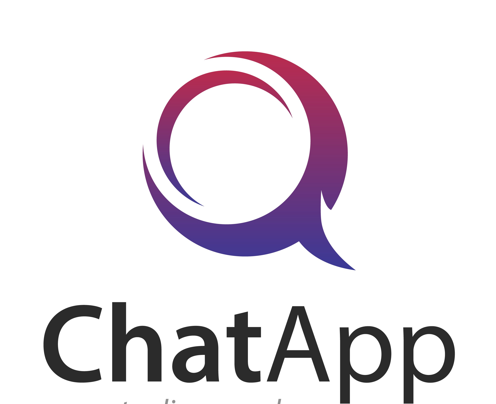

<!--
*** Thanks for checking out the Best-README-Template. If you have a suggestion
*** that would make this better, please fork the repo and create a pull request
*** or simply open an issue with the tag "enhancement".
*** Thanks again! Now go create something AMAZING! :D
-->


<!-- PROJECT SHIELDS -->
<!--
*** I'm using markdown "reference style" links for readability.
*** Reference links are enclosed in brackets [ ] instead of parentheses ( ).
*** See the bottom of this document for the declaration of the reference variables
*** for contributors-url, forks-url, etc. This is an optional, concise syntax you may use.
*** https://www.markdownguide.org/basic-syntax/#reference-style-links
-->
[![Contributors][contributors-shield]][contributors-url]
[![Forks][forks-shield]][forks-url]
[![Stargazers][stars-shield]][stars-url]
[![Issues][issues-shield]][issues-url]
[![LinkedIn][linkedin-shield]][linkedin-url]


<!-- PROJECT LOGO -->
<br />
<p align="center">
  <a href="https://github.com/tianxiangtee/txchat-client">
    
  </a>
  <br/>
  <a href="https://www.vecteezy.com/free-vector/chat-logo">Chat Logo Vectors by Vecteezy</a>

  <h3 align="center">TX Chat App </h3>

  <p align="center">
    An awesome React Chat App (Client) using MERNG Stack for backend!
    <br />
    <a href="https://github.com/tianxiangtee/txchat-client"><strong>Explore the docs »</strong></a>
    <br />
    <br />
    <a href="https://txchat.netlify.app/">View Demo</a>
    ·
    <a href="https://github.com/tianxiangtee/txchat-client/issues">Report Bug</a>
    ·
    <a href="https://github.com/tianxiangtee/txchat-client/issues">Request Feature</a>
  </p>
</p>


<!-- TABLE OF CONTENTS -->
<details open="open">
  <summary>Table of Contents</summary>
  <ol>
    <li>
      <a href="#about-the-project">About The Project</a>
      <ul>
        <li><a href="#built-with">Built With</a></li>
      </ul>
    </li>
    <li>
      <a href="#getting-started">Getting Started</a>
      <ul>
        <li><a href="#prerequisites">Prerequisites</a></li>
        <li><a href="#installation">Installation</a></li>
      </ul>
    </li>
    <li><a href="#usage">Usage</a></li>
    <li><a href="#roadmap">Roadmap</a></li>
    <li><a href="#contributing">Contributing</a></li>
    <li><a href="#license">License</a></li>
    <li><a href="#contact">Contact</a></li>
    <li><a href="#acknowledgements">Acknowledgements</a></li>
  </ol>
</details>


<!-- ABOUT THE PROJECT -->
## About The Project

[![Product Name Screen Shot][product-screenshot]](https://example.com)

Hello guys, this is a beta project for me to learn and code along with MERNG stack. The chat app is able to support text, gif, and also some sticker pack for communication. There are still a lot of features like picture or file upload are missing and I may add in when I am free in the future. Thanks!!

### Built With
* [React](https://reactjs.org/)
* [Graphql](https://graphql.org/)
* [Apollo Client](https://www.apollographql.com/docs/react/)
* [React-bootstrap](https://react-bootstrap.github.io/)


<!-- GETTING STARTED -->
## Getting Started

This is an example of how you may give instructions on setting up your project locally.
To get a local copy up and running follow these simple example steps.

### Prerequisites

This is an example of how to list things you need to use the software and how to install them.
* npm
  ```sh
  npm install npm@latest -g
  ```

### Installation

1. Clone the repo
   ```sh
   git clone https://github.com/tianxiangtee/txchat-client.git
   ```
3. Install NPM packages
   ```sh
   npm install
   ```
4. Enter your backend url in `src/ApolloProvider.js` (Should be seperated the url in config file in future)
   ```JS
   const host = 'Enter your server url';
   ```
   Please refer to the server code at <a href="https://github.com/tianxiangtee/txchat-server">here</a>


<!-- USAGE EXAMPLES -->
## Usage


_For more examples, please refer to the [Documentation](https://txchat.netlify.app/)_


<!-- ROADMAP -->
## Roadmap

See the [open issues](https://github.com/tianxiangtee/txchat-client/issues) for a list of proposed features (and known issues).


<!-- CONTRIBUTING -->
## Contributing

Contributions are what make the open source community such an amazing place to be learn, inspire, and create. Any contributions you make are **greatly appreciated**.

1. Fork the Project
2. Create your Feature Branch (`git checkout -b feature/AmazingFeature`)
3. Commit your Changes (`git commit -m 'Add some AmazingFeature'`)
4. Push to the Branch (`git push origin feature/AmazingFeature`)
5. Open a Pull Request


<!-- LICENSE -->
## License

Distributed under the MIT License. See `LICENSE` for more information.


<!-- CONTACT -->
## Contact

Your Name - [@LinkedIn](https://www.linkedin.com/in/tee-tian-xiang-139a7615a/) - kyoxiang99@gmail.com

Project Link: [https://github.com/tianxiangtee/txchat-client](https://github.com/tianxiangtee/txchat-client)


<!-- MARKDOWN LINKS & IMAGES -->
<!-- https://www.markdownguide.org/basic-syntax/#reference-style-links -->
[contributors-shield]: https://img.shields.io/github/contributors/tianxiangtee/txchat-client.svg?style=for-the-badge
[contributors-url]: https://github.com/tianxiangtee/txchat-client/graphs/contributors
[forks-shield]: https://img.shields.io/github/forks/tianxiangtee/txchat-client.svg?style=for-the-badge
[forks-url]: https://github.com/tianxiangtee/txchat-client/network/members
[stars-shield]: https://img.shields.io/github/stars/tianxiangtee/txchat-client.svg?style=for-the-badge
[stars-url]: https://github.com/tianxiangtee/txchat-client/stargazers
[issues-shield]: https://img.shields.io/github/issues/tianxiangtee/txchat-client.svg?style=for-the-badge
[issues-url]: https://github.com/tianxiangtee/txchat-client/issues
[linkedin-shield]: https://img.shields.io/badge/-LinkedIn-black.svg?style=for-the-badge&logo=linkedin&colorB=555
[linkedin-url]: https://www.linkedin.com/in/tee-tian-xiang-139a7615a/
[product-screenshot]: Github/screenshot.png
